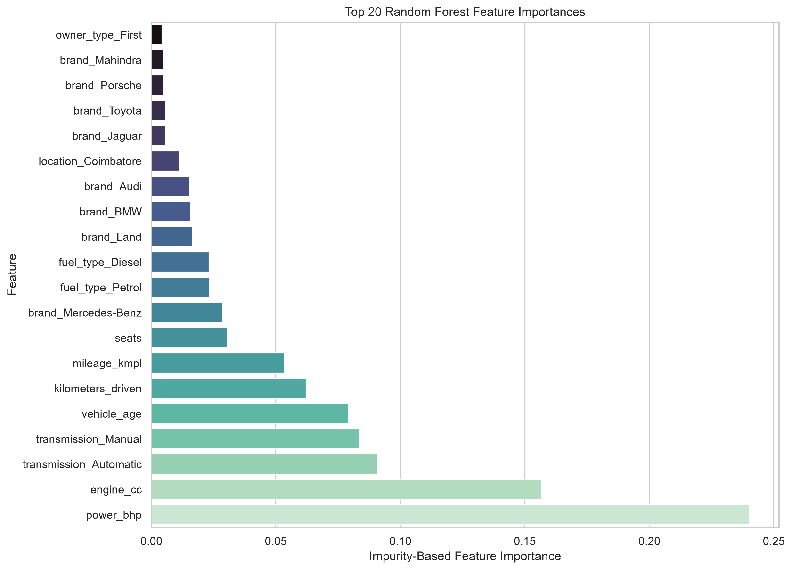

# Used Car Price Prediction

An end-to-end data science project that cleans used-car listings, explores pricing patterns, and trains regression models to estimate used-car listing prices.

## Overview

This project uses a used-car listings dataset to answer a practical regression question:

> Given a vehicle's age, kilometres driven, specifications, manufacturer, location, fuel type, transmission, and ownership history, how accurately can its listed price be estimated?

The workflow covers data cleaning, exploratory data analysis (EDA), feature engineering, leakage-safe preprocessing, model evaluation, feature-importance analysis, and reproducible model export.

## Project highlights

- Cleaned a raw dataset of 7,255 listings into a labelled modelling dataset of 6,019 records.
- Converted unit-bearing text fields into numerical features, including mileage, engine displacement, and engine power.
- Engineered vehicle age and manufacturer features.
- Investigated data-quality issues such as missing values, zero mileage values, invalid seat counts, unrealistic engine values, and implausibly high odometer readings.
- Compared a median baseline, Ridge Regression, and Random Forest models.
- Evaluated both raw-price and log-transformed-price modelling approaches.
- Selected a raw-target Random Forest as the primary model based on its RMSE and R-squared performance.

## Dataset

The dataset contains used-car listings with vehicle details such as:

- Vehicle name and location
- Manufacturing year
- Kilometres driven
- Fuel type and transmission
- Owner history
- Mileage
- Engine displacement
- Engine power
- Number of seats
- New-car price where available
- Used-car listing price

The target variable is `price`, measured in Indian lakh.

### Dataset source
https://www.kaggle.com/datasets/ayushparwal2026/cars-dataset
https://creativecommons.org/publicdomain/zero/1.0/


## Repository structure

```text
used-car-price-prediction/
├── data/
│   ├── raw/                         # Original Kaggle dataset (may be excluded from Git)
│   └── processed/
│       └── used_cars_cleaned.csv    # Cleaned labelled dataset
├── notebooks/
│   ├── 01_data_cleaning.ipynb       # Cleaning and feature engineering
│   ├── 02_exploratory_analysis.ipynb# EDA and visualisations
│   └── 03_price_prediction.ipynb    # Preprocessing, modelling, and evaluation
├── outputs/
│   ├── figures/                     # Saved visualisations
│   ├── model_results.csv             # Model comparison metrics
│   └── models/
│       └── random_forest_raw_price_metadata.json
├── .gitignore
├── requirements.txt
└── README.md
```

## Data preparation

The original dataset contained 7,255 listings. The supervised-learning dataset contains 6,019 listings with a known price.

### Cleaning decisions

- Removed the serial-number field because it is an identifier rather than a vehicle attribute.
- Excluded `new_price` from the initial model because 86.13% of its values were missing.
- Excluded rows with missing `price` from supervised training because price is the prediction target.
- Extracted numerical values from text fields:
  - `mileage` → `mileage_kmpl`
  - `engine` → `engine_cc`
  - `power` → `power_bhp`
- Created `vehicle_age` using 2020 as the fixed reference year.
- Extracted `brand` from the first token of the vehicle name.
- Converted zero or negative mileage, zero-seat values, engine values below 500 cc, and odometer readings above 500,000 km to missing values instead of dropping entire listings.
- Left remaining feature-level missing values for model-pipeline imputation, fitted on training data only.

## Exploratory findings

- Listed prices are strongly right-skewed: skewness is approximately 3.3, the median price is 5.64 lakh, and the mean is 9.48 lakh.
- Prices vary substantially by manufacturer. High-volume brands such as Maruti and Hyundai have lower typical prices than luxury brands such as BMW, Audi, Mercedes-Benz, Jaguar, and Land Rover.
- Vehicle age is negatively associated with price, with a correlation of approximately -0.31 against raw price and -0.47 against `log1p(price)`.
- Kilometres driven has a weaker negative association with price, approximately -0.18.
- Engine power and displacement have strong positive associations with price. Their correlations with price are approximately +0.77 and +0.66 respectively.
- Price distributions differ by fuel type, transmission, ownership history, and location. Automatic vehicles have a median listed price of approximately 16.0 lakh, compared with approximately 4.5 lakh for manual vehicles.
- Applying `log1p(price)` reduces target skewness from approximately 3.3 to approximately 0.75.

## Modelling approach

### Input features

Numeric features:

- `vehicle_age`
- `kilometers_driven`
- `mileage_kmpl`
- `engine_cc`
- `power_bhp`
- `seats`

Categorical features:

- `brand`
- `location`
- `fuel_type`
- `transmission`
- `owner_type`

The raw vehicle `name` feature was excluded from the first model because it is a high-cardinality string field. `year` was excluded because `vehicle_age` represents the same time-related information more directly.

### Preprocessing

All preprocessing is performed within scikit-learn pipelines:

- Numeric features: median imputation and standard scaling
- Categorical features: most-frequent imputation and one-hot encoding
- Split: 80% training / 20% test
- Random seed: `42`

Putting preprocessing inside the pipeline prevents test-set information from influencing imputation, scaling, or category encoding.

### Models evaluated

- Median `DummyRegressor` baseline
- Ridge Regression
- Random Forest Regressor
- Ridge Regression trained on `log1p(price)`
- Random Forest trained on `log1p(price)`

Metrics are calculated on the original price scale after inverse-transforming predictions from log-target models.

## Results

| Model | MAE (lakh) | RMSE (lakh) | R² |
|---|---:|---:|---:|
| Median baseline | 5.998 | 11.696 | -0.112 |
| Ridge Regression | 3.118 | 5.409 | 0.762 |
| Random Forest | 1.784 | 3.917 | 0.875 |
| Ridge Regression, log target | 1.844 | 4.365 | 0.845 |
| Random Forest, log target | 1.772 | 4.329 | 0.848 |

### Selected model

The raw-target Random Forest was selected as the primary model. It achieved the lowest RMSE (3.917 lakh) and highest R² (0.875), while its MAE of 1.784 lakh was only marginally higher than the log-target Random Forest's MAE of 1.772 lakh.

The log-target Random Forest may be preferable when minimising average absolute error is the sole priority. However, the raw-target model better controlled larger errors on the original price scale.

## Feature importance

The Random Forest's leading individual predictive features were:

1. `power_bhp` — 0.240
2. `engine_cc` — 0.157
3. `transmission_Automatic` — 0.091
4. `transmission_Manual` — 0.083
5. `vehicle_age` — 0.079
6. `kilometers_driven` — 0.062
7. `mileage_kmpl` — 0.053

Transmission should be interpreted as a grouped categorical concept: its automatic and manual one-hot encoded indicators together have an importance of approximately 0.174. Brand, fuel type, location, and owner history are also each represented by multiple encoded indicator columns.

Feature importances indicate how the fitted Random Forest used variables to reduce prediction error. They are predictive associations, not causal effects.



## Visualisations

Selected generated charts are stored in `outputs/figures/`, including:

- Price distribution and log-price distribution
- Median price by brand
- Vehicle age and kilometres-driven relationships with price
- Price comparisons by categorical features
- Numeric-feature correlation heatmap
- Actual versus predicted Random Forest prices
- Random Forest residuals
- Feature-importance charts

## Installation

### 1. Clone the repository

```bash
git clone https://github.com/YOUR_GITHUB_USERNAME/used-car-price-prediction.git
cd used-car-price-prediction
```

### 2. Create and activate a virtual environment

Windows PowerShell:

```powershell
python -m venv .venv
.\.venv\Scripts\Activate.ps1
```

macOS/Linux:

```bash
python3 -m venv .venv
source .venv/bin/activate
```

### 3. Install dependencies

```bash
pip install -r requirements.txt
```

### 4. Run the notebooks

```bash
jupyter notebook
```

Run the notebooks in numerical order:

1. `01_data_cleaning.ipynb`
2. `02_exploratory_analysis.ipynb`
3. `03_price_prediction.ipynb`

## Reproducibility

The selected model uses an 80/20 train/test split with `random_state=42`. The modelling notebook trains the selected raw-target Random Forest, evaluates all models, generates visualisations, writes `outputs/model_results.csv`, and can export a local serialized model.

The serialized `.joblib` model file is intentionally excluded from this repository because it is a relatively large binary artifact. Run `03_price_prediction.ipynb` to reproduce model training and export the model locally. The small metadata JSON file records the selected model configuration, expected features, library versions, and test metrics.

## Limitations and future work

- `price` is an advertised listing price, not a confirmed transaction price.
- The data represents a particular market and historical period, so it may not generalise to current prices or other regions.
- Brand extraction uses the first word of each listing name. This incorrectly represents multi-word manufacturers such as `Land Rover` as `Land`.
- Detailed model, trim, and edition information were excluded from the first model because raw vehicle names are high-cardinality. More careful make/model/trim feature engineering could improve premium-segment estimates.
- Several technical fields contain missing values and are median-imputed during training.
- Premium and rare vehicles show larger prediction errors because there are fewer comparable examples in training data.
- The dataset contains some potentially anomalous prices and vehicle attributes that may affect individual predictions.

## Author

Karel Makabu Kande

Second-year BSc Information Technology (Data Science) student at Eduvos.
